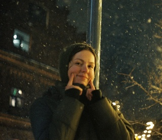

## [rsschool-cv](https://nraduzhnaya.github.io/rsschool-cv/cv "my CV in HTML/CSS")

---
### *Hello, I am*
# Anastasia Dugan 


---
## Contacts
- **tel**: +7 (904) 602-42-71
- **e-mail**: anastasia.dugan.vog@gmail.com
- **telegram**: @nraduzhnaya
- **discord-username**: Anastasia Dugan (@nraduzhnaya)

---
## About Me
I am an aspiring front-end developer, currently learning HTML, CSS, and JavaScript through courses at RS School and HTML Academy, as well as various online resources. I do not have a formal IT education, but my interest in web development grew from my experience in marketing research and exploring user experience (UX).

I aim to create intuitive and enjoyable interfaces for users and to be part of a team that makes the online space more user-friendly. At the moment, I am working on projects in my courses and plan to further develop my skills, including improving my English to a B1 level to read professional literature and learn new technologies.

---
## Skills
- HTML, CSS, JavaScript (basic)
- BEM (Block-Element-Modifier) 
- Fundamentals of responsive design (basic)
- Git/GitHub (basic)
- Figma

---
## Code Example
```
function boolToWord( bool ){
  return bool ? "Yes" : "No";
}
```
---
## Experience
Currently focused on intensive front-end learning (5–10 hours daily).

**_My projects_**: [My CV-Project for RS-School](https://nraduzhnaya.github.io/rsschool-cv/cv)

---
## Education
+ **Bachelor, Volgograd State University, 2017**
    - Faculty of Management and Regional Economics
+ **Courses at HTML Academy, in progress**

---
## English
**A2 (Pre-Intermediate или Elementary)** - I can talk about myself, maintain light small talk, and read simple texts

> I could easily survive in another country using my English.
---
